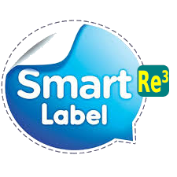
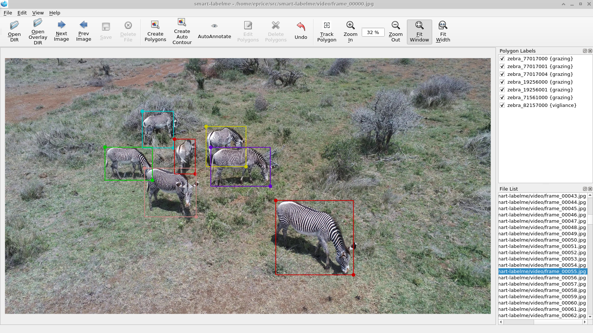

<h1 align="center">
  <br/>Smarter-labelme
</h1>

<h4 align="center">
  Video / Image Annotation (Polygon, Semantic mask, Classification) with Python and Re3 and SSD-Multibox
</h4>

<br/>

<div align="center">
  
</div>

## Description

Smarter-labelme is a graphical image annotation tool for various image annotation needs such as classification, semantic segmentation, polygonal rois etc.  
It support some smart features like object detection, annotation tracking, auto contouring etc. to speed up the annotation task.
It is written in Python and uses Qt for its graphical interface.

<i>Auto tracking of polygons between frames with Re³ + SSD-Multibox</i>
   

<i>Auto contouring feature using OpenCV grab cut</i>
   

## Features

- [x] Image annotation for polygon, rectangle, circle, line and point.
- [x] Image flag annotation for classification and cleaning.
- [x] Object-detection for automatic rectangle annotation.
- [x] Auto-contouring for fast polygon annotation.
- [x] Auto tracking to track and copy polygon annotations between frames.
- [x] Scripts for semantic segmentation creation from polygonal annotations.
- [x] Video annotation. 
- [x] GUI customization (predefined labels / flags, auto-saving, label validation, etc).

A [Preprint outlining the methods](https://arxiv.org/abs/2302.09590) has been uploaded to [arXiv.org](https://arxiv.org/abs/2302.09590)

## Requirements

- Ubuntu / macOS / Windows
- Python2 / Python3
- [PyQt4 / PyQt5](http://www.riverbankcomputing.co.uk/software/pyqt/intro) / [PySide2](https://wiki.qt.io/PySide2_GettingStarted)
- PyTorch


## Installation
You can install via pip:

```bash
python3 -m pip install --upgrade "git+https://github.com/robot-perception-group/smarter-labelme@master"
```

### Hint on Pytorch

Pytorch will be installed by pip as a dependency by the above command, if it is not already installed, however you will want to select the matching version for your system from https://pytorch.org/get-started/locally/ -- if you do not have a GPU, use

```
pip3 install torch torchvision --extra-index-url https://download.pytorch.org/whl/cpu
```

## Usage

Run `smarter_labelme --help` for detail.  
The annotations are saved as a [JSON](http://www.json.org/) file.

```bash
smarter_labelme  # just open gui
```
### Neural Network weights.

Smarter-labelme will automatically download pretrained network weights via torch.hub on the first start. They will be cashed in your local user directory and use approximately 200 Mb of space. You can use your own weights instead with the --ssdmodel and --re3model flags.

### Command Line Arguments
- `--output` specifies the location that annotations will be written to. Annotations will be stored in this directory with a name that corresponds to the image that the annotation was made on.
- The first time you run labelme, it will create a config file in `~/.labelmerc`. You can edit this file and the changes will be applied the next time that you launch labelme. If you would prefer to use a config file from another location, you can specify this file with the `--config` flag.
- Without the `--nosortlabels` flag, the program will list labels in alphabetical order. When the program is run with this flag, it will display labels in the order that they are provided.
- `--labels` allows to limit labels to a determined set, for example MSCOCO. The parameter can be a text file with one label per line or a comma-separated list.
- `--flags` allows to specify per-image flags. The parameter can be a text file with one label per line or a comma-separated list.
- `--labelflags` allows to specify per-annotation flags to give additional information beyond the label, for example for behavior annotation. The syntax is JSON with regular expressions, for example `--labelflags {.*: [occluded,running,walking,sleeping]}`. There is one internal labelflag - "disable_visual_tracking" which can be used to disable the automated visual tracker. Objects with this flag set will simply be copied to the next frame unchanged whenever `Track-Polygon` is engaged.

## Video annotation procedure with instance tracking.

1. Install Smarter-labelme
2. If you have a .AVI or .MP4 file, use `ffmpeg` to extract the video. Smarter-labelme provides a wrapper to preserve frame IDs `smarter_labelme_video2frames <video> <output_folder> [--fps [fps]|"full"]`. The default fps is 8, specify "full" to extract all frames from the video.
3. Start `smarter_labelme` with appropriate labelflags for your task (see above). e.g. `smarter_labelme --labelflags '{.*: ["grazing","standing","walking","running"]}'`
4. Open the directory where your extracted the video frames. They will be displayed in order, sorted by filename.
5. You can try to annotate with the "Auto-annotate" button. Each detected object will receive a label based on detected class and a unique ID.
6. Fix any misdetections and/or add not detected objects. The shortcut for rectangle annotations is `Ctrl+R`. Press `ESC` to go back to edit mode when you are done.
7. All objects should have unique labels. This is easiest achieved if giving the type of object, followed by a unique number.
8. Enter Edit mode (`ESC`), then select those objects you would like to track across frames. You can do so by clicking the first entry in the `Polygon-Labels` widget and then shift-clicking the last.
9. Click `Track-Polygon` to engage the tracker for the selected objects.
10. Switch to the next frame. Smarter-labelme will automatically try to track and follow all selected object instances and add them to the next frame.
11. Fix all bounding boxes as needed. If the tracker consistently fails or misbehaves for an object, you can edit this object-label (`Ctrl+E`) and select the "disable_visual_tracking" flag.
12. Continue this process for all frames. If new objects appear in the video, add new bounding boxes, then repeat from step 8 on that frame. Objects that disappeared can simply be deleted.
13. The Annotations will be stored in machine readable JSON files in the `Annotations` subfolder of your input directory.

## Acknowledgement

This repo is the fork of [bhavyaajani/smart-labelme](https://github.com/bhavyaajani/smart-labelme).


## Cite This Project

If you use this project in your research or wish to refer to the baseline results published in the README, please use the following BibTeX entries.

```bash
@misc{price2023accelerated,
      title={Accelerated Video Annotation driven by Deep Detector and Tracker}, 
      author={Eric Price and Aamir Ahmad},
      year={2023},
      eprint={2302.09590},
      archivePrefix={arXiv},
      primaryClass={cs.CV},
      url = {https://arxiv.org/abs/2302.09590},
}
```
```bash
@misc{smarter-labelme2023,
  author =       {Eric Price},
  title =        {{Smarter-labelme: }},
  howpublished = {\url{https://github.com/robot-perception-group/smarter-labelme}},
  year =         {2023}
}
```
```bash
@misc{smart-labelme2020,
  author =       {Bhavya Ajani},
  title =        {{Smart-labelme: Video / Image Annotation (Polygon, Semantic mask, Classification) with Python}},
  howpublished = {\url{https://github.com/bhavyaajani/smart-labelme}},
  year =         {2020}
}
```

```bash
@misc{labelme2016,
  author =       {Kentaro Wada},
  title =        {{labelme: Image Polygonal Annotation with Python}},
  howpublished = {\url{https://github.com/wkentaro/labelme}},
  year =         {2016}
}
```
